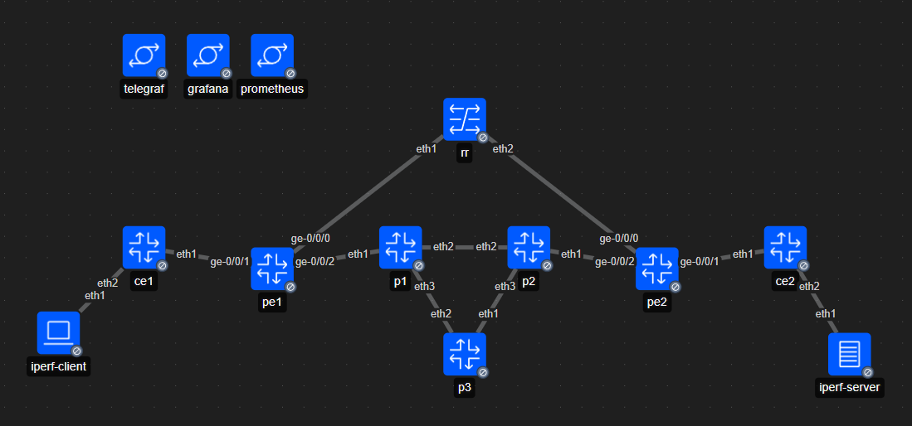

# gNMI and SNMP Telemetry

Telemetry comparison for SNMP and gNMI standards using a transit BGP/MPLS testbed on Containerlab.
The environment simulates a Service Provider backbone operating a BGP-Free Core, utilizing OSPF and LDP for underlay transport, and iBGP/eBGP for external routing. The observability pipeline is subjected to volumetric DDoS bursts and BGP route flapping.

## Topology

The topology proposed is heterogenous:
*   **Provider Edge (PE):** Juniper `vJunos-router` (Data-plane encapsulation and eBGP boundaries)
*   **Provider Core (P) and Route Reflector (RR):** Arista `cEOS` (MPLS label switching and iBGP reflection)
*   **Customer Edge (CE):** ExaBGP containers (Automated route injection and anomaly generation)



## Stack

The observability is containerized as well:
*   **Telegraf:** Unified collection engine handling both SNMP (`GETBULK` / `TRAP`) and gNMI (`SAMPLE` / `ON_CHANGE`)
*   **Prometheus:** Time-series database for metrics retention
*   **Grafana:** Visualization layer utilizing PromQL to expose telemetry aliasing and micro-bursts


## Build
### Prerequisities
*   Docker and Containerlab
*   Python 3 and Jinja2
*   Licensed images for Juniper `vJunos-router` and Arista `cEOS` loaded into the local Docker daemon

Deploy the entire laboratory using Containerlab. This parses the YAML definition, creates the isolated management bridge, and establishes the virtual point-to-point datalinks:

```bash
sudo containerlab deploy -t telemetry-lab.clab.yml
```

To build the configuration files for the nodes:

```bash
python3 configs/build.py
```

It will leverage Jinja2 templates as well ``rr.conf``.

To evaluate the telemetry collectors, the network must be stressed.
The ``iperf.py`` script utilizes the Docker subprocess API to inject 200 Mbps UDP micro-bursts from the iperf-client to the iperf-server across the MPLS core, testing the protocol's ability to detect link saturation:

```bash
python3 iperf.py
```

The ExaBGP nodes utilize internal Python script ``route_leak.py`` to inject and withdraw 200 dynamic prefixes every 15 seconds to expose SNMP temporal aliasing.
Once deployed, the visualization layer is accessible via the host machine:

* Grafana: http://localhost:3000 (default credentials: admin / admin)

* Prometheus: http://localhost:9090/targets